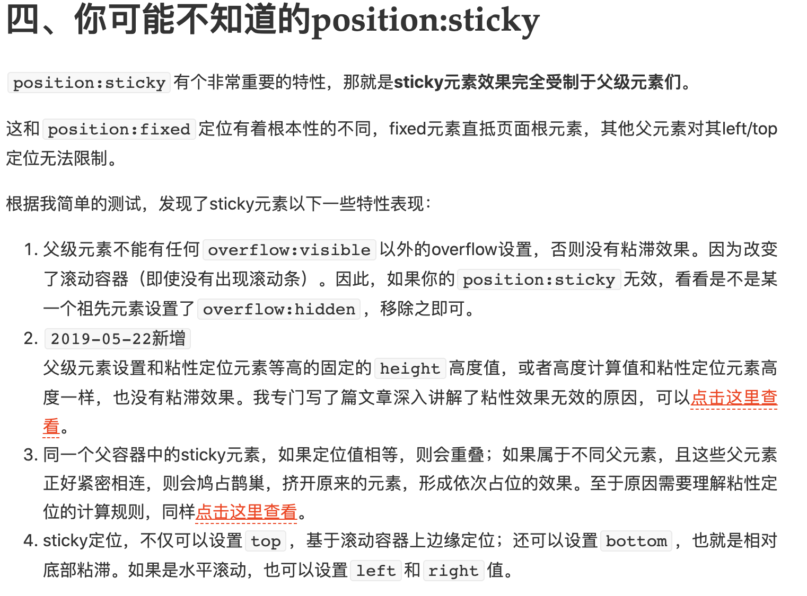

`sticky`参考文章：<https://www.zhangxinxu.com/wordpress/2018/12/css-position-sticky/>
# position
可取的值：
* `static` 默认值。没有定位，元素出现在正常的流中
* `absolute` 生成绝对定位的元素，相对于非 `static`定位的最近的父元素进行定位。
* `fixed`	生成绝对定位的元素，相对于浏览器窗口进行定位。
* `relative` 生成相对定位的元素，相对于其正常位置进行定位。
* `inherit`	规定应该从父元素继承`position`属性的值。
* `sticky` 当元素在屏幕内，表现为relative，就要滚出显示器屏幕的时候，表现为fixed，但是相对的是父元素
