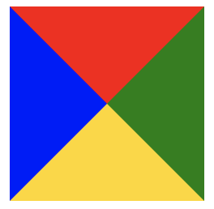
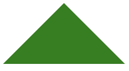
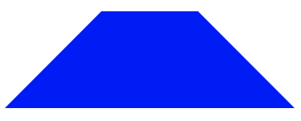
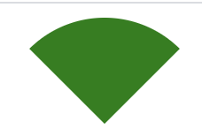

# CSS画梯形、三角形
## 重新认识border
```css
.content{
    width: 0;
    height: 0;
    border-width: 60px;
    border-style: solid;
    border-color: red green gold blue;
  }
```
效果图：  

## css 画三角形
```css
.content{
  width: 0;
  border-style: solid;
  border-color: transparent transparent green;
  border-width: 0 60px 60px ;
}
```

## css画梯形
```css
.content{
  width: 60px;
  border-width: 0 60px 60px;
  border-style: solid;
  border-color: transparent transparent blue
}
```

# CSS 画扇形的css代码
```css
.content{
  width: 0;
  border-style: solid;
  border-color: green transparent transparent;
  border-width:  60px 60px 0;
  border-top-left-radius: 60px;
  border-top-right-radius: 60px;
}
```

