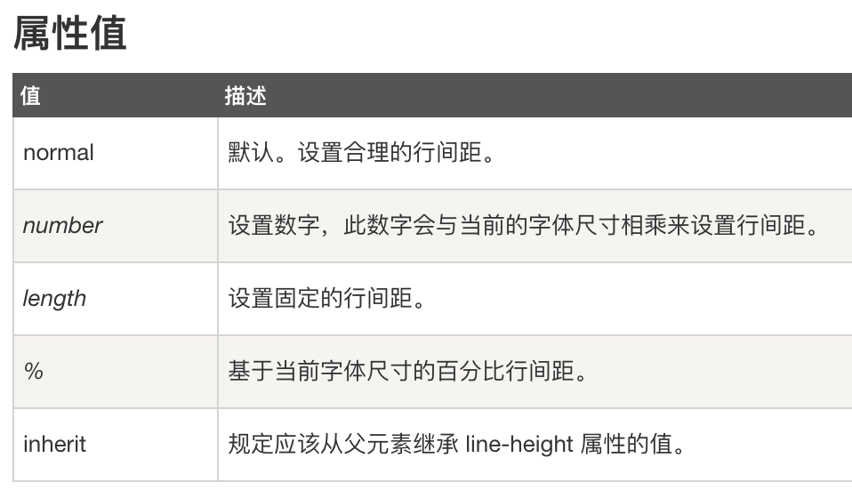

## `line-height`的可能取值

## `line-height`取值150%和1.5的区别
* `line-height:150%`，是先计算再继承，先根据父元素的`font-size`大小计算出`line-height`的值，再继承给子、孙元素；
* `line-height:1.5`，是先继承再计算，根据子元素自己的`font-size`大小去乘以1.5来计算行高;
* 另外，1.5em也是按照150%的情况来算的