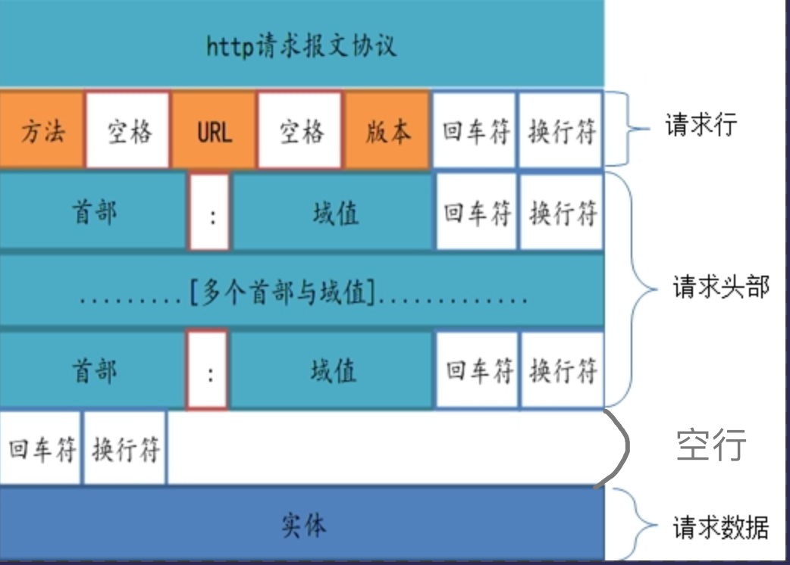
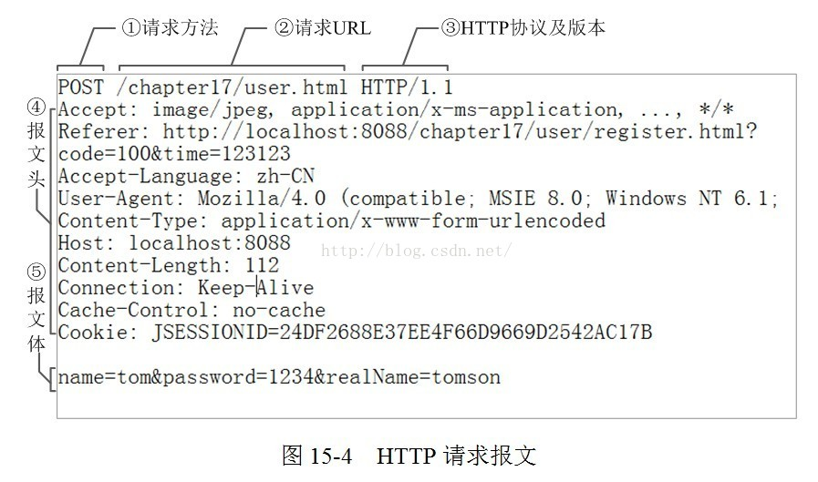
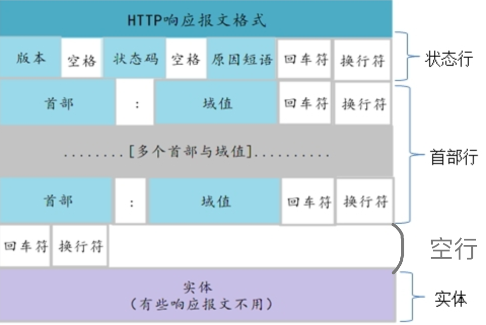

原文地址：<https://www.cnblogs.com/kageome/p/10859996.html>
# 概念
用于HTTP协议交换的信息叫做报文。HTTP报文本身是由多行数据组成的字符串。
# 报文组成
HTTP报文报文分为请求报文和响应报文。
请求报文包含四部分：
1. 请求行：请求方法、URL、HTTP版本信息
2. 请求头
3. 空行
4. 请求内容实体
响应报文包含四部分：
1. 状态行：HTTP版本、状态码、状态码的原因短语
2. 响应首部字段
3. 空行
4. 响应内容实体

