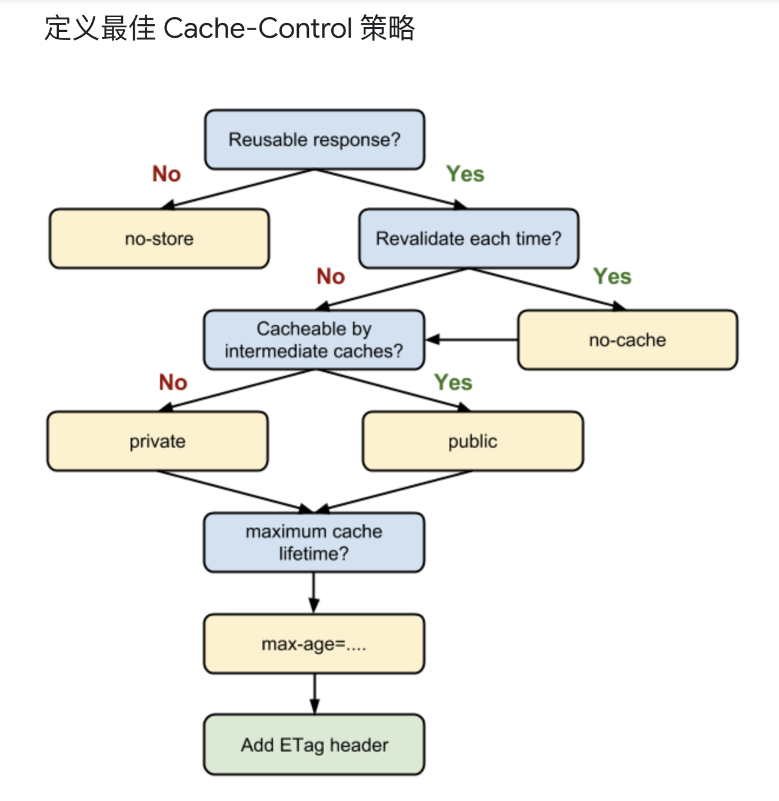

# 浏览器缓存
http缓存将不常修改的文件保存在本地，下次需要时可以直接使用，避免重复向服务器请求。主要针如css，js，图片等更新频率不大的静态文件
# 浏览器缓存相关的请求头/响应头
##  Expires
* `Expires:Thu, 28 Sep 2017 06:38:37 GMT`
* 响应消息头字段 
* 表示资源的过期时间，是一个绝对时间，在这个时间之前，不需要再向浏览器请求资源，直接用缓存；
* HTTP1.0中的字段，优先级低于`max-age`
* 缺点：用户可以修改客户端时间导致浏览器判断失效；时差也可能导致客户端时间与服务器时间不一致；写法复杂，容易出错
## Cache-Control
### 通用消息头字段
### 可缓存性相关取值
* no-store 不缓存
* no-cache 协商缓存，每次都向服务器发送请求，询问缓存是否可用
* public 可以被任何对象（客户端和代理服务器如：CDN等）缓存
* private 只能被发起请求的客户端缓存，代理服务器如：CDN不能缓存
### 到期相关取值
* max-age=\<seconds>  相对时间，超过这段时间缓存失效，HTTP1.1中新增的字段，优先级高于`Expires`
* s-maxage=\<seconds>  相对时间，超过这段时间缓存失效，用于共享缓存，客户端会忽略，代理服务器看来，优先级大于max-age
### 设置多个值时，用','隔开，如：`Cache-Control:public, max-age=31536000`
## `Last-Modified`&`If-Modified-Since`
* `Last-Modified:Thu, 28 Sep 2017 06:38:37 GMT;`
* 响应消息头字段
* 资源最后一次被修改的时间，浏览器会将这个时间和响应内容一起保存下来，下次请求相同资源时，在不确定是否可以使用缓存的情况下（过期或者设置为no-cache），浏览器自动将`Last-Modified`的值写入`If-Modified-Since`中发往服务器，服务器对比`Last-Modified`和`If-Modified-Since`是否相等，相等则表示未修改，返回304；不等则表示已修改，返回200、新的资源以及新的`Last-Modified`
* 缺点：极端情况下，资源在1s内再次修改的话，记录的时间不会变，因为`Last-Modified`以秒为单位；如果文件是服务器动态生成的，每次访问`Last-Modified`的值都不一样，都是文件重新生成的时间，尽管文件内容没有发生变化
## `Etag`&`If-None-Match`
* 为了解决上述问题而产生,`Etag`是文件的特殊标识（一般是hash值），之后的流程同上，比对`Etag`&`If-None-Match`，命中返回304，不命中返回200、新资源和新的`Etag`
* 缺点：分布式系统中，不同的浏览器产生的`Etag`不同
## `Etag`优先级高于`Last-Modified`

相关文章：  
[Cache-Control-MDN](https://developer.mozilla.org/zh-CN/docs/Web/HTTP/Headers/Cache-Control)   
[HTTP 缓存（较权威）](https://developers.google.com/web/fundamentals/performance/optimizing-content-efficiency/http-caching?hl=zh-cn)   
[彻底理解浏览器缓存机制](https://www.cnblogs.com/shixiaomiao1122/p/7591556.html)   
[深入理解浏览器的缓存机制](https://www.jianshu.com/p/54cc04190252)
