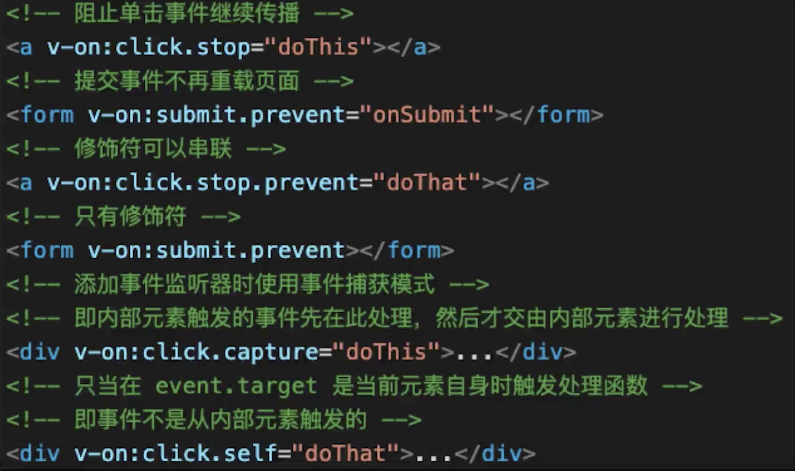
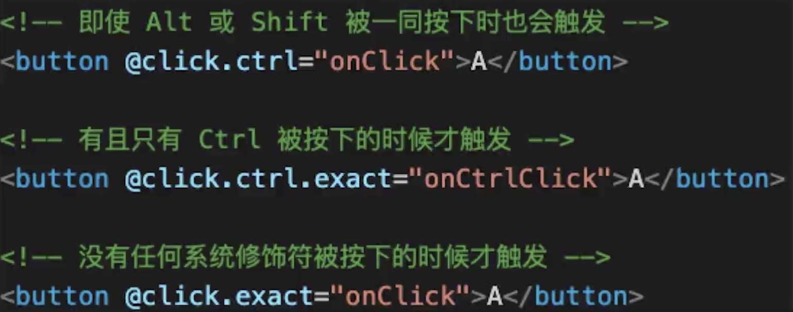

## 插值{{}}、表达式
## 指令、动态属性
## v-html：会有xss风险，会覆盖子组件
## `computed`和`watch`
* `computed`有缓存，data不变则不会重新计算；
* `watch`默认浅监听，深度监听，设置`deep:true`
* `watch`监听引用类型，拿不到oldval
## `class`和`style`
* 动态属性
* css属性要使用驼峰式写法
## `v-if`、`v-else`和`v-show`
## `v-for`
* 可以用`v-for`遍历对象
* `v-for`和`v-if`不要一起使用,`v-for`比`v-if`级别高
## 事件
* event对象是原生对象
* 事件绑定在当前元素
* 事件修饰符

## 表单
* `v-model`
* 常见表单项`textarea`、`checkbox`、`radio`、`select`
* 修饰符：`v-model.lazy`、`v-model.number`、`v-model.trim`
